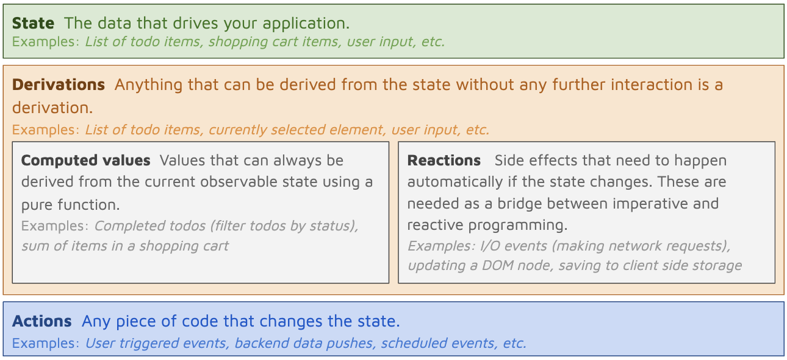

# An introduction to MobX in React

_This is a high level introduction to MobX in React based on a Lunch and Learn session I held at work. The original presentation can be found [here on Google Slides](https://docs.google.com/presentation/d/1PyKOPfLLVSORgLBGHto6xN4xpB214JDA4glOVx9ETvw/edit#slide=id.g8ebf37b0f0_3_249)._

## What is MobX?

Michel Weststrate, the creator of MobX, [described it](https://codeburst.io/the-curious-case-of-mobx-state-tree-7b4e22d461f) best when he said to think of MobX as "data flow library, that enables you to roll your own state management architecture with minimal effort".

The [documentation](https://mobx.js.org/README.html) goes more in depth:

> **MobX is a battle tested library that makes state management simple and scalable by transparently applying functional reactive programming (TFRP)**

MobX is a library that can help us manage application state in a simple and scalable way. But what exactly does it mean to do that _"transparently applying functional reactive programming"_?

### Transparent

Under the hood MobX is following an observable pattern which requires subscribing to values and handling update notifications. It makes this whole abstraction layer _transparent_. All we need to worry about is making a store and a component.

### Reactive

By marking a value as an `observable` value and a React component that consumes data as an `observer`, the React components will be _reacting_ to value changes.

### Functional

When values change we perform functional transformations such as map, reduce, filter, and compose.

MobX alone simply provides the core functionality of dealing with make data observable. In order to have React components actually _react_ to our data we need a binding like [mobx-react](https://github.com/mobxjs/mobx-react) or its aptly named sibling that sounds like the name of a domestic beer [mobx-react-lite](https://github.com/mobxjs/mobx-react-lite).

## Trade offs

### Benefits

- MobX doesn't make assumptions about our data. _That means its pretty flexible and doesn't care if your data is not normalized or has a graph structure structure._
- Allows for clear encapsulation of data and logic utilizing JavaScript classes
- Minimal boilerplate code. It is declarative. We simply mark functions and values to focus on the what of domain logic, rather than the how to achieve it
- Provides out-of-the-box efficiency. MobX internally tracks dependencies and caches results to only recompute if necessary. Meaning we have no need for redux selector memoization!
- Supports value-oriented programming. Value-oriented programming focuses on value changes rather than how they change. We would think of a stream of changing values propagating versus a stream of events propagating changes

### Drawbacks

- Not immutable
- Unable to revert to previous states
- Requires greater understanding of the API
- Slight increase in complexity while working across multiple domains or stores.

## Core Concepts

Here is a diagram I created using the information from the [documentation](https://mobx.js.org/README.html).

## Principals

>  Make sure that everything that can be derived from the application state, will be derived. Automatically.

The core principals of MobX (___derivations___ and ___computed values___) ensure everything is automatically derived from the application state.

Derivations
- Update __automatically__ and __atomically__ when state changes (no intermediate values)
- Update __synchronously__ (actions can inspect a computed value directly after altering state)

Computed values
- Should remain __pure__ (not change state)
- Update __lazily__ (will not be updated until needed for a side effect I/O)

